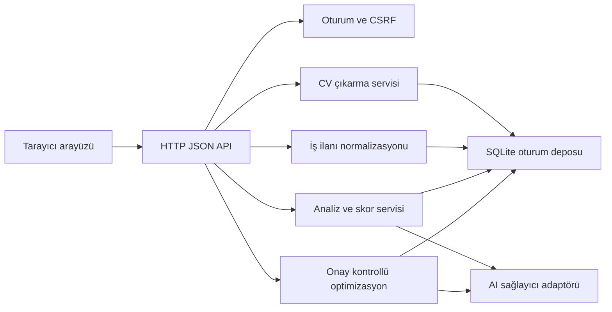

# Mimari

## Karar özeti

İlk sürüm, tek bir Python süreci içinde statik web arayüzü, JSON API, alan servisleri ve SQLite veri deposu kullanır. Bu seçim MVP'nin az bağımlılıkla kurulmasını ve temel güvenlik kurallarının tek yerde uygulanmasını sağlar. Alan servisleri HTTP katmanından ayrıdır; büyüme gerektiğinde API, arka plan işleri ve veri deposu bağımsız bileşenlere ayrılabilir.

## Bileşenler

- `app/server.py`: HTTP, güvenlik başlıkları, oturum çerezi, CSRF ve statik dosyalar.
- `app/repository.py`: SQLite şeması, oturum izolasyonu, sürümlü kayıtlar ve silme.
- `app/extractors.py`: PDF/DOCX imza doğrulaması ve kaynak konumlu metin çıkarma.
- `app/language.py`: İngilizce girdi için korumacı dil kontrolü.
- `app/analysis.py`: Deterministik eşleştirme, skor ve açıklanabilir bulgular.
- `app/ai.py`: İsteğe bağlı OpenAI adaptörü; geçersiz çıktıda güvenli geri dönüş.
- `app/optimization.py`: Açık onay, kaynak doğrulama ve ATS metin üretimi.
- `static/`: Erişilebilir tek sayfa arayüz.

## Veri akışı

1. Sunucu kısa ömürlü oturum ve CSRF belirteci üretir.
2. CV dosyası base64 JSON olarak en fazla 5 MiB alınır; imza ve içerik doğrulanır.
3. İş ilanı İngilizce ve uzunluk açısından doğrulanır.
4. Analiz, aynı oturumdaki CV ve ilan sürümlerini karşılaştırır.
5. Kullanıcı kararı belge sürümlerine bağlı kaydedilir.
6. Yalnızca geçerli “Evet” kararında optimizasyon çalışır.
7. Çıktı kaynak CV içeriğine karşı doğrulanır ve metin dosyası olarak indirilebilir.

## Güven sınırları

Tarayıcı, yüklenen dosya, iş ilanı ve model çıktısı güvenilmeyen girdidir. Kimlik ve kapsam sunucu tarafında belirlenir. AI çıktısı alan şemasından ve kaynak kanıt kontrolünden geçmeden depolanmaz veya kullanıcıya nihai CV olarak sunulmaz.

