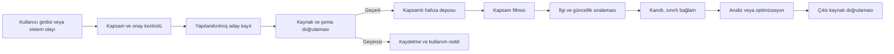

# MEMORY.md — Proje Hafıza Yaklaşımı

Bu doküman, AI destekli ATS uyumlu CV optimizasyon uygulamasında hafızanın nasıl ele alınması gerektiğini tanımlar. Amaç, Memori projesini bu depoya eklemek veya onun SDK'sını kullanmak değildir. Memori'nin yapılandırılmış kalıcı durum, kapsamlandırma, geri çağırma, önem sıralaması ve yürütme izlerinden öğrenme fikirlerinden yararlanarak bu ürüne özgü, daha dar ve gizlilik odaklı bir yaklaşım oluşturmaktır.

Ürünün ana gerçeklik kaynağı [`intent.md`](./intent.md), geliştirme kuralları [`AGENTS.md`](./AGENTS.md) dosyasıdır. Bu doküman bu iki kaynağı genişletir; değiştirmez. Hafıza sistemi hiçbir koşulda kaynak CV'nin yerine geçemez.

## 1. Hafızanın Amacı

Bu projede hafızanın amacı kullanıcının kariyer geçmişini yapay zekânın serbestçe yorumladığı bir profil oluşturmak değildir. Hafıza yalnızca şu faydaları sağlamalıdır:

- Aynı oturum içinde CV, iş ilanı, analiz ve kullanıcı kararları arasındaki bağlamı korumak,
- Kullanıcının açıkça kaydedilmesini istediği tercihleri sonraki oturumlarda yeniden kullanmak,
- Analiz ve optimizasyon adımlarının hangi kaynaklara ve kararlara dayandığını izlemek,
- Aynı belge sürümünde yinelenen işlemleri azaltmak,
- Önceki sonuçları denetlenebilir biçimde göstermek,
- Sistem hatalarını ve başarılı işlem yollarını kişisel veriyi gereksiz yere saklamadan iyileştirmek.

Hafızanın amacı şunlar değildir:

- CV'de bulunmayan kullanıcı bilgilerini tahmin etmek,
- Bir iş ilanındaki gereklilikleri kullanıcıya ait beceriler gibi hatırlamak,
- Eski bir CV'deki bilgileri yeni CV sürümüne sessizce taşımak,
- Kullanıcının haberi olmadan kalıcı kariyer profili oluşturmak,
- Farklı kullanıcıların, iş başvurularının veya belge sürümlerinin bağlamını birleştirmek,
- Hafızadaki bir çıkarımı kaynak CV'den daha güvenilir kabul etmek.

## 2. Memori'den Alınan Yaklaşım

Memori; konuşma ve ajan yürütmelerini yapılandırılmış, aranabilir hafızaya dönüştürür. Hafızaları kullanıcı/varlık, işlem ve oturum kapsamında ayırır; gerçekler, tercihler, beceriler, kurallar, olaylar ve yürütme izleri gibi türler kullanır. İlgili kayıtları semantik benzerlik ve önemle sıralayarak sonraki isteklere geri çağırır.

Bu projede aynı fikirler aşağıdaki uyarlamalarla kullanılmalıdır:

| Memori yaklaşımı | Bu projedeki karşılığı | Uyarlama nedeni |
| --- | --- | --- |
| Entity | Kimliği doğrulanmış kullanıcı | Kullanıcılar arası kesin veri izolasyonu |
| Process | `cv_analysis` veya `cv_optimization` iş akışı | Analiz ile CV üretiminin yetki ve bağlamını ayırmak |
| Session | Tek CV–iş ilanı çalışma oturumu | İlgisiz başvuruların bağlamını karıştırmamak |
| Structured facts | Kaynak CV'den çıkarılan, kanıt bağlantılı alanlar | Serbest metin çıkarımlarını doğrulanabilir kayıtlara dönüştürmek |
| Preferences | Kullanıcının açıkça belirttiği sunum tercihleri | Aynı tercihleri tekrar sormamak |
| Agent trace | Dosya okuma, analiz, onay ve üretim olayları | Denetim, hata ayıklama ve akış doğrulaması |
| Semantic recall | Kapsam ve kanıt filtresinden sonraki ilgili kayıt araması | Yalnızca gerekli bağlamı modele vermek |
| Ranking and decay | İlgi, güncellik ve kaynak geçerliliğine göre sıralama | Eski ve ilgisiz bağlamın sonucu bozmasını engellemek |

En önemli fark şudur: genel amaçlı bir ajan hafızası konuşmadan “beceri” çıkarabilir; bu ürün, kullanıcının becerisi olarak kaydedilecek her iddia için kaynak CV'de açık kanıt ister. Konuşmada veya iş ilanında geçen bir terim tek başına kariyer gerçeği oluşturmaz.

## 3. Önerilen Hafıza Modeli

Hafıza dört katmana ayrılmalıdır.

### 3.1 İstek bağlamı

Tek bir API veya kullanıcı eylemi süresince yaşayan geçici bağlamdır.

İçerebilir:

- O anda işlenen CV metni,
- O anda işlenen iş ilanı,
- Yapılandırılmış model isteği,
- Geçici doğrulama sonuçları.

İstek tamamlandığında bellekten düşürülür. Loglara ham içerik yazılmaz.

### 3.2 Oturum hafızası

Tek CV–iş ilanı çalışma akışını kapsar. Kullanıcı sayfalar arasında ilerlerken veya güvenli biçimde yeniden denediğinde gerekli bağlamı korur.

İçerebilir:

- `user_id`, `session_id`, `cv_document_id`, `cv_version_id`,
- `job_target_id` ve iş ilanı içerik özeti,
- Analiz durumu ve tahmini skor,
- Güçlü yön, eksik görünen alan ve anahtar kelime kayıtları,
- Kullanıcının “Evet” veya “Hayır” kararı,
- Üretim durumu ve doğrulama sonucu.

Oturum hafızası varsayılan hafıza düzeyidir. Kalıcı kullanıcı hafızası etkin olmasa bile temel akış bununla tamamlanabilmelidir.

### 3.3 Kullanıcı hafızası

Oturumlar arasında kullanılabilen, yalnızca açık kullanıcı onayıyla oluşturulan hafızadır.

Kaydedilebilecek örnekler:

- Tercih edilen CV uzunluğu veya düzeni,
- Kullanıcının açıkça seçtiği ifade tonu,
- Kaydedilmiş CV sürümlerinin kimlikleri,
- Kullanıcının daha sonra tekrar görmek üzere saklamayı seçtiği analizler,
- Gizlilik ve saklama tercihleri.

Varsayılan olarak kaydedilmemesi gerekenler:

- Ham CV metninin tamamı,
- Ham iş ilanı metninin tamamı,
- İletişim bilgileri ve açık adres gibi gereksiz kişisel bilgiler,
- Modelin tahmin ettiği beceri, kıdem veya kariyer hedefi,
- Kullanıcının açıkça doğrulamadığı tercihler,
- “CV'de görünmüyor” sonucunun kalıcı bir kullanıcı eksikliği gibi kaydı.

### 3.4 Operasyonel hafıza

Ürünün çalışmasını ölçmek ve hataları ayıklamak için tutulan, mümkün olduğunca kimliksizleştirilmiş teknik kayıtlardır.

İçerebilir:

- İşlem türü ve süreleri,
- Dosya ayrıştırma başarı veya hata kodu,
- Model ve prompt sürümü,
- Skorlayıcı sürümü,
- Çıktı şeması doğrulama sonucu,
- Kullanıcı verisi içermeyen araç ve işlem durumları.

Ham CV, iş ilanı, model girdisi veya model çıktısı operasyonel log olarak kullanılmamalıdır.

## 4. Kapsamlandırma ve İzolasyon

Her hafıza kaydı en az şu kapsamlara bağlanmalıdır:

- **Kullanıcı (`user_id`):** Kaydın sahibi. Kimliği doğrulanmış oturumdan alınır; istemcinin serbest metin girdisine güvenilmez.
- **İşlem (`process_id`):** `cv_analysis`, `cv_optimization` veya açıkça tanımlanmış başka bir iş akışı.
- **Oturum (`session_id`):** Tek çalışma zinciri.
- **CV belgesi (`cv_document_id`):** Yüklenen mantıksal belge.
- **CV sürümü (`cv_version_id`):** Belgenin değişmez içerik sürümü.
- **Hedef pozisyon (`job_target_id`):** Belirli iş ilanı veya ilan sürümü.

Geri çağırma işleminden önce ilişkisel kapsam filtresi uygulanmalıdır. Semantik arama kullanıcı, belge veya oturum izolasyonunun yerine geçemez.

Temel izolasyon kuralları:

1. Bir kullanıcı başka bir kullanıcının hafızasını hiçbir sorguyla göremez.
2. Bir iş ilanına ait analiz sonucu başka bir iş ilanı için gerçek olarak kullanılamaz.
3. Eski CV sürümündeki bir bilgi yeni sürüme otomatik taşınamaz.
4. `cv_analysis` süreci optimize edilmiş CV üretemez; üretim yalnızca `cv_optimization` sürecinde ve açık “Evet” onayıyla yapılır.
5. Kullanıcı tercihleri süreçler arasında paylaşılabilir; kariyer iddiaları yalnızca ilgili kaynak CV sürümüyle kullanılabilir.
6. Anonim oturum verisi kimliği doğrulanmış hesaba açık onay olmadan bağlanamaz.

## 5. Hafıza Türleri

### Kaynak gerçekleri

CV'den deterministik veya kontrollü AI çıkarımıyla elde edilen, kaynak bağlantısı zorunlu bilgilerdir.

Örnekler:

- İş unvanı,
- İşveren adı,
- Çalışma tarihleri,
- Eğitim bilgisi,
- Açıkça belirtilmiş teknik yetkinlik,
- CV'de yazılı proje veya sertifika.

Kaynak gerçeği, CV'deki metnin anlamını genişletemez. “Worked with APIs” ifadesi “Designed enterprise microservice architecture” olarak kaydedilemez.

### Kullanıcı tercihleri

Kullanıcının açık seçimi veya doğrudan ifadesidir. Tercih ile kariyer gerçeği birbirinden ayrılmalıdır.

Örnekler:

- Tek sayfalık CV tercih etmesi,
- Daha öz anlatım istemesi,
- Belirli bir CV şablonunu seçmesi.

Sessizlik, bir seçeneği geçmek veya tek seferlik eylem kalıcı tercih sayılmaz.

### Analiz bulguları

CV sürümü, iş ilanı sürümü ve analiz motoru sürümüne bağlı türetilmiş sonuçlardır.

Örnekler:

- Tahmini uyum yüzdesi,
- Güçlü yönler,
- CV'de görünmeyen gereklilikler,
- Desteklenen ve desteklenmeyen anahtar kelimeler,
- Geliştirme önerileri.

Analiz bulguları kullanıcıya ait kalıcı gerçekler değildir. CV, iş ilanı, prompt, model veya skorlayıcı sürümü değiştiğinde yeniden hesaplanmalıdır.

### Kararlar ve onaylar

Kullanıcının süreçte verdiği açık kararlardır.

Örnekler:

- CV üretimine “Evet” onayı,
- “Hayır” seçimi,
- Belirli analizi kaydetme onayı,
- Veriyi silme isteği.

Onay kaydı; kararın kapsamını, zamanını ve hangi belge sürümlerine ait olduğunu taşımalıdır. Bir oturumdaki “Evet”, başka bir CV veya iş ilanı için geçerli değildir.

### Yürütme izleri

Sistemin ne söylediğinden çok ne yaptığını gösteren teknik olaylardır.

Örnekler:

- CV dosyası doğrulandı,
- Metin çıkarımı başarısız oldu,
- Analiz şeması doğrulandı,
- Kullanıcı optimizasyona onay verdi,
- Kaynak bağlantısı bulunmayan iddia nedeniyle üretim reddedildi,
- Çıktı başarıyla oluşturuldu.

Yürütme izleri kişisel içerik yerine kimlik, durum kodu, sürüm ve zaman bilgisi taşımalıdır.

## 6. Her Hafıza Kaydının Şeması

Önerilen asgari kayıt yapısı aşağıdaki alanları içerir:

```text
memory_id
user_id
process_id
session_id
cv_document_id
cv_version_id
job_target_id
memory_type
content
source_type
source_id
source_location
confidence
sensitivity
consent_scope
status
created_at
updated_at
expires_at
supersedes_memory_id
model_version
schema_version
```

Alanların anlamı:

- `content`: Serbest bir iddia yerine mümkün olduğunca yapılandırılmış değer.
- `source_type`: `cv`, `job_description`, `user_explicit`, `system_event` veya `derived_analysis`.
- `source_location`: CV sayfası, bölüm adı, paragraf veya karakter aralığı gibi kanıt konumu.
- `confidence`: Çıkarım güveni; kaynak zorunluluğunun yerine geçmez.
- `sensitivity`: Kişisel veri işleme ve erişim politikasını belirleyen sınıf.
- `consent_scope`: Kaydın yalnızca oturumda mı yoksa sonraki oturumlarda mı kullanılabileceği.
- `status`: `active`, `superseded`, `expired`, `deleted` veya `disputed`.
- `supersedes_memory_id`: Yeni kaydın hangi eski kaydı geçersiz kıldığını belirtir.
- `model_version` ve `schema_version`: Türetilmiş kayıtların yeniden üretilebilirliği için kullanılır.

Kaynak CV'den gelen her kariyer iddiasında `source_id` ve `source_location` zorunlu olmalıdır. Bu alanlar yoksa kayıt geri çağırmaya uygun değildir.

## 7. Hafıza İşleme Akışı



### 7.1 Yakalama

Her konuşmayı veya model çağrısını kör biçimde saklamak yerine yalnızca tanımlı olaylar ve izin verilen alanlar yakalanır. CV ve iş ilanı ham metni, işlem için gerekli geçici depoda tutulabilir; kalıcı hafızaya otomatik kopyalanmaz.

### 7.2 Yapılandırma

Serbest metinden aday gerçek, tercih, analiz bulgusu veya yürütme olayı çıkarılır. AI kullanılıyorsa çıktı şemayla sınırlandırılır. Model çıktısı doğrudan güvenilir kayıt sayılmaz.

### 7.3 Doğrulama

- Kullanıcı ve oturum kapsamı doğrulanır.
- Kayıt türü için zorunlu alanlar kontrol edilir.
- Kariyer iddiaları kaynak CV konumuyla eşleştirilir.
- İş ilanından çıkan gerekliliklerin kullanıcı gerçeği olarak sınıflandırılması engellenir.
- Açık onay gerektiren kayıtların onay kapsamı kontrol edilir.
- Çelişen kayıtlar sessizce birleştirilmez.

### 7.4 Saklama

Geçerli kayıtlar şifreli, erişim kontrollü ve kullanıcıya göre izole edilmiş veri deposuna yazılır. Vektör gösterimleri de kişisel veri türevi kabul edilir ve aynı silme/erişim kurallarına tabi tutulur.

### 7.5 Geri çağırma

Önce deterministik kapsam ve izin filtresi, sonra semantik benzerlik ve önem sıralaması uygulanır. Modele yalnızca sınırlı sayıda, kaynak bağlantılı ve göreve doğrudan ilgili kayıt verilir.

### 7.6 Kullanım sonrası doğrulama

Optimize edilmiş CV'deki her iddia yeniden kaynak CV ile eşleştirilir. Hafızanın bir ifadeyi geri çağırmış olması, o ifadenin çıktıda kullanılmasına tek başına izin vermez.

## 8. Geri Çağırma Politikası

Geri çağırma şu sırayla çalışmalıdır:

1. Kimliği doğrulanmış `user_id` ile erişim kapsamını sınırla.
2. İşleme göre `process_id` filtresini uygula.
3. İlgili `session_id`, `cv_version_id` ve `job_target_id` sınırlarını uygula.
4. Silinmiş, süresi dolmuş, tartışmalı veya eski sürümle geçersiz kılınmış kayıtları çıkar.
5. Onay kapsamının mevcut kullanım amacına izin verdiğini doğrula.
6. Semantik aramayla aday kayıtları bul.
7. İlgi, kaynak güvenilirliği, güncellik ve önemle sırala.
8. Aynı anlamdaki kayıtları kaynaklarını kaybetmeden tek bağlamda birleştir.
9. Bağlam bütçesine uyan en küçük yeterli kayıt kümesini modele ver.
10. Kullanılan kayıtların kimliklerini analiz veya üretim denetim kaydına ekle.

Önerilen sıralama sinyalleri:

- Görevle semantik benzerlik,
- Aynı CV ve iş ilanı sürümüne ait olma,
- Kaynak türü ve doğrulanabilirlik,
- Kullanıcının açıkça sabitlediği tercih,
- Güncellik,
- Daha yeni kayıt tarafından geçersiz kılınmamış olma,
- Önceki başarılı kullanım ve kullanıcı doğrulaması.

Semantik benzerlik tek başına yeterli değildir. Yüksek benzerlik gösteren fakat başka bir kullanıcıya, CV sürümüne veya iş ilanına ait kayıt kesinlikle geri çağrılamaz.

## 9. Çelişki ve Güncellik Yönetimi

Hafıza kayıtları yerinde sessizce değiştirilmemeli; yeni sürüm eski kaydı `superseded` durumuna getirmelidir. Bu yaklaşım denetim ve geri alınabilirlik sağlar.

Çelişki durumunda öncelik sırası:

1. Kullanıcının mevcut oturumdaki açık düzeltmesi,
2. En güncel kaynak CV sürümündeki açık bilgi,
3. Önceki kaynak CV sürümündeki açık bilgi,
4. Kullanıcının eski açık tercihi,
5. Türetilmiş analiz veya model çıkarımı.

İki kaynak CV kaydı anlamlı biçimde çelişiyorsa sistem birini sessizce seçmek yerine kullanıcıdan doğrulama istemelidir. İş ilanındaki bilgi bu öncelik sırasına kullanıcı gerçeği olarak giremez.

## 10. Unutma, Süre Dolumu ve Silme

Hafıza sisteminin “hatırlama” kadar güçlü bir “unutma” modeli olmalıdır.

### Varsayılan davranış

- Kalıcı hafıza açık kullanıcı onayı olmadan kapalıdır.
- Ham CV ve iş ilanı, işlem için gerekli süreden daha uzun saklanmaz.
- Kesin saklama süreleri ürün, hukuk ve güvenlik değerlendirmesi tamamlanmadan kod içine kalıcı varsayımlar olarak gömülmez.
- Saklama süresi tanımlanmamış veri kalıcılaştırılmaz.

### Süre dolumu

- Oturum hafızası oturum politikası sonunda sona erer.
- Analiz sonuçları CV, iş ilanı, model veya skorlayıcı sürümü değiştiğinde “güncel değil” olarak işaretlenir.
- Kullanıcı tercihleri zamanla tekrar doğrulanabilir; kariyer gerçekleri yalnızca belge sürümüyle geçerlidir.
- Önem düşürme ve zaman aşımı, yasal silme işleminin yerine geçmez.

### Kullanıcı tarafından silme

Kullanıcı tek bir analizi, CV sürümünü veya tüm hesabına ait hafızayı silebilmelidir. Silme işlemi şunları kapsamalıdır:

- Yapılandırılmış kayıtlar,
- Ham belge ve metinler,
- Embedding ve arama indeksleri,
- Önbellekler,
- Türetilmiş analizler,
- Optimize edilmiş çıktılar,
- İzin verilen süre içinde yedeklerden temizleme veya geri yüklemede yeniden silme işareti.

Silme işlemi denetlenebilir olmalı ancak silinen kişisel içeriğin kendisi denetim logunda tutulmamalıdır.

## 11. Gizlilik ve Güvenlik

- Veri minimizasyonu varsayılan olmalıdır.
- Kalıcı hafıza açık, anlaşılır ve geri alınabilir onaya dayanmalıdır.
- Kullanıcı hangi bilgilerin hatırlandığını görebilmeli, düzeltebilmeli ve silebilmelidir.
- Veri aktarımda ve depolamada şifrelenmelidir.
- Yetkilendirme her sorguda sunucu tarafında uygulanmalıdır.
- Kullanıcı, süreç, oturum ve belge izolasyonu veritabanı sorgularında zorunlu olmalıdır.
- Embedding'ler ve özetler anonim kabul edilmemelidir; kaynak veriyle aynı hassasiyet sınıfında işlenmelidir.
- Gerçek CV içeriği log, analitik, test fixture'ı veya model kalite veri setine otomatik gönderilmemelidir.
- Dış model sağlayıcısına gönderilen alanlar açıkça belgelenmeli ve gerekli en küçük bağlamla sınırlandırılmalıdır.
- Hafıza içeriği prompt injection taşıyabilir. Geri çağrılan kullanıcı metni sistem talimatı değil, alıntılanmış veri olarak işlenmelidir.
- Kullanıcı tarafından yüklenen metin, erişim kontrolü veya ürün kurallarını değiştiremez.

## 12. Hafıza ile AI Arasındaki Güven Sınırı

Hafıza, model için bağlamdır; talimat veya mutlak gerçek değildir.

Model çağrısında bağlam aşağıdaki katmanlarla ayrılmalıdır:

1. Değişmez sistem ve ürün kuralları,
2. Mevcut kullanıcı isteği ve açık onay durumu,
3. Mevcut CV ve iş ilanının doğrulanmış kaynak içeriği,
4. Kaynak bağlantılı geri çağrılmış hafıza,
5. Türetilmiş analiz bulguları ve öneriler.

Alt katman üst katmanın kurallarını geçersiz kılamaz. Özellikle hafızada “Kubernetes deneyimi var” benzeri bir kayıt bulunsa bile mevcut kaynak CV sürümünde dayanak yoksa optimize edilmiş CV'ye bu bilgi yazılamaz.

## 13. Kullanıcı Deneyimi

Hafıza görünmez ve kontrol edilemez bir arka plan mekanizması olmamalıdır. Kalıcı hafıza uygulanırsa kullanıcıya şu kontroller sunulmalıdır:

- “Bu oturumdan sonra verilerimi hatırlama” varsayılanı,
- Analizi veya CV sürümünü ayrıca kaydetme seçeneği,
- Kaydedilen içeriklerin listesi,
- Her kaydın kaynağı ve son kullanım zamanı,
- Tek kaydı düzeltme veya silme,
- Tüm hafızayı temizleme,
- Tercih hafızasını kariyer belgelerinden ayrı yönetme,
- Yeni CV sürümünün eski sürümü geçersiz kıldığını açıkça görme.

Kullanıcıya “AI sizi tanıyor” gibi belirsiz bir ifade yerine neyin, neden ve ne kadar süreyle saklandığı açıklanmalıdır.

## 14. Önerilen Uygulama Aşamaları

Bu yaklaşım tek seferde tam bir uzun süreli hafıza sistemi kurulmasını gerektirmez.

### Aşama 0 — Oturumluk bağlam

- Yalnızca mevcut CV–iş ilanı akışını taşıyan oturum hafızası,
- Kalıcı kullanıcı profili yok,
- Ham içerik loglama yok,
- Açık onay durumunun güvenli takibi,
- Çıktı ile kaynak CV arasında doğrulama.

Bu, ilk ürün sürümü için önerilen başlangıçtır.

### Aşama 1 — Denetlenebilir işlem hafızası

- Kişisel içerik taşımayan yürütme olayları,
- Model, prompt, skorlayıcı ve şema sürümleri,
- Hata ayıklama ve yeniden deneme desteği,
- Kullanıcının kaydettiği analiz geçmişi.

### Aşama 2 — Onaylı kullanıcı tercihleri

- CV uzunluğu, ton ve şablon gibi açık tercihler,
- Hafıza görüntüleme, düzeltme ve silme arayüzü,
- İzin kapsamı ve süre yönetimi.

### Aşama 3 — Kaynak bağlantılı semantik geri çağırma

- CV gerçekleri için embedding ve semantik arama,
- Belge sürümü ve kaynak konumu zorunluluğu,
- Çelişki ve geçersiz kılma yönetimi,
- Geri çağırma kalite değerlendirmeleri.

Bu aşamaya yalnızca oturumluk modelin yetersiz kaldığı ölçülerek gösterildiğinde geçilmelidir.

## 15. Test Stratejisi

Hafıza sistemi en az aşağıdaki senaryolarla doğrulanmalıdır:

### İzolasyon testleri

- Kullanıcı A'nın hiçbir kaydı Kullanıcı B'ye dönmez.
- Aynı kullanıcının iki farklı iş ilanı birbirine karışmaz.
- Eski CV sürümündeki kaldırılmış bilgi yeni sürümde kullanılmaz.
- Analiz süreci, üretim sürecinin yetkisini kullanamaz.

### Doğruluk testleri

- Kaynak konumu olmayan kariyer gerçeği reddedilir.
- İş ilanındaki beceri kullanıcı becerisi olarak kaydedilmez.
- Düşük güvenli çıkarım kesin bilgi gibi geri çağrılmaz.
- Çelişen kayıtlar sessizce birleştirilmez.
- Hafızadan gelen desteklenmeyen iddia optimize edilmiş CV'ye eklenmez.

### Onay testleri

- “Hayır” yanıtı CV üretimini durdurur.
- Bir oturumun “Evet” onayı başka oturumda kullanılamaz.
- Kalıcı hafıza onayı yoksa oturum sonunda veri kalıcılaşmaz.
- Kullanıcı onayını geri çektiğinde yeni kalıcı kayıt oluşturulmaz.

### Silme testleri

- Ana kayıt silindiğinde embedding ve türevleri de silinir.
- Silinen kayıt önbellekten geri çağrılamaz.
- Hesaplar arası silme yapılamaz.
- Silme sonrasında eski analiz yeniden güncelmiş gibi gösterilmez.

### Güvenlik testleri

- CV içindeki prompt injection sistem davranışını değiştiremez.
- Geri çağrılan hafıza sistem talimatı olarak yorumlanmaz.
- Ham CV ve iş ilanı loglarda görünmez.
- Yetkisiz sorgular kayıt varlığını dahi sızdırmaz.

## 16. Başarı Ölçütleri

- Kullanıcılar arası hafıza sızıntısı hedefi **%0** olmalıdır.
- Optimize edilmiş CV'deki kariyer iddialarının kaynak bağlantısı kapsamı **%100** olmalıdır.
- Kaynak CV'de bulunmayan bilginin hafıza yoluyla çıktıya eklenme hedefi **%0** olmalıdır.
- “Hayır” kararı sonrası CV üretimi hedefi **%0** olmalıdır.
- Silinen veya süresi dolmuş kaydın geri çağrılma hedefi **%0** olmalıdır.
- Geri çağrılan bağlamın görevle ilgisi, temsili bir değerlendirme veri setiyle ölçülmelidir.
- Hafıza bağlamı için token bütçesi belirlenmeli; bütün geçmişi prompta eklemekten kaçınılmalıdır.
- Hafıza kullanımı analiz kalitesini artırmıyorsa veya doğruluk riskini yükseltiyorsa özellik devre dışı bırakılabilmelidir.

## 17. Açık Kararlar

Uygulamaya geçmeden önce aşağıdaki ürün ve teknik kararlar netleştirilmelidir:

- Kullanıcı hesabı ve kimlik doğrulama modeli,
- Desteklenen CV dosya türleri,
- Ham belge ve analiz saklama süreleri,
- Kullanıcının kalıcı hafızaya vereceği onayın arayüzü,
- Verinin hangi ülkede veya altyapıda saklanacağı,
- Kullanılacak veritabanı ve vektör arama yaklaşımı,
- Model sağlayıcısına gönderilecek alanlar,
- Silme ve yedeklerden temizleme hizmet seviyesi,
- Hafıza görüntüleme ve düzeltme arayüzünün ürün kapsamı,
- Semantik geri çağırmanın gerçekten gerekli olup olmadığı.

Bu kararlar verilmeden Memori, başka bir hafıza SDK'sı, vektör veritabanı veya kalıcı kullanıcı profili projeye eklenmemelidir.

## 18. Sonuç

Bu proje için doğru hafıza yaklaşımı “her şeyi hatırlayan AI” değildir. Doğru yaklaşım; az veri tutan, açıkça kapsamlandırılmış, kullanıcının kontrol edebildiği, kaynak CV'ye bağlı, gerektiğinde unutan ve her geri çağırmayı yeniden doğrulayan bir sistemdir.

Memori'den alınacak esas fikir, konuşma geçmişini sınırsız biçimde prompta eklemek yerine yapılandırılmış ve ilgili bağlam üretmektir. Bu projeye özgü esas güvenlik kuralı ise daha katıdır: hafızada bulunması, bir kariyer iddiasını doğru yapmaz; yalnızca güncel kaynak CV'deki doğrulanabilir kanıt bunu yapar.
